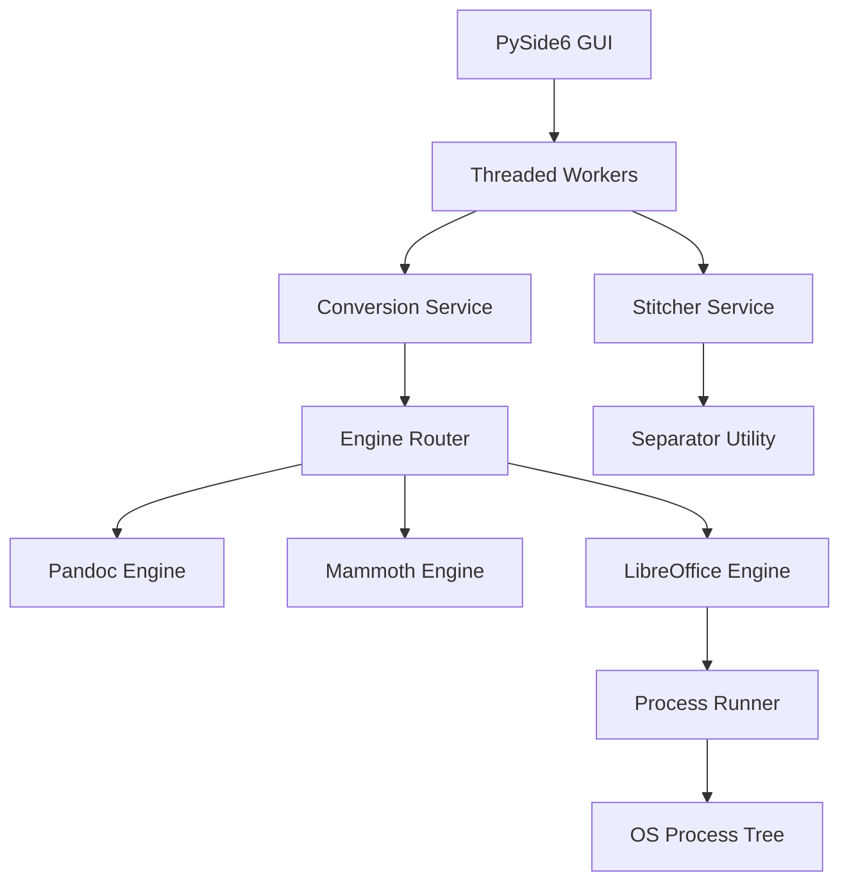

# Solution Architecture

## Component Graph

## Component Descriptions

### 1. PySide6 GUI (`app/ui/`)
- **Purpose**: Provides a responsive user interface for queue management, settings, and status monitoring.
- **Interactions**: Sends task requests to `Threaded Workers` to keep the main thread unblocked.

### 2. Threaded Workers (`app/workers/`)
- **Purpose**: Encapsulates long-running I/O and CPU tasks.
- **Key Design Choice**: Uses Qt Signals/Slots for progress reporting and cancellation signaling.

### 3. Conversion Service (`app/conversion/service.py`)
- **Purpose**: Orchestrates the execution of a `ConversionPlan` across multiple engines.
- **Input**: `list[QueueItem]`, `AppSettings`.
- **Output**: `list[ConversionResult]`, `RunReport`.

### 4. Engine Router (`app/conversion/router.py`)
- **Purpose**: Decides the optimal engine sequence for a given file extension and risk profile.
- **Key Design Choice**: Decouples "what to do" (Plan) from "how to do it" (Engine implementation).

### 5. LibreOffice Engine (`app/conversion/libreoffice_engine.py`)
- **Purpose**: Handles legacy `.doc` and `.odf` files by wrapping `soffice.exe` in headless mode.
- **Safety**: Uses isolated temp profiles to avoid concurrency conflicts.

### 6. Process Runner (`app/core/process.py`)
- **Purpose**: Executes external binaries with strict timeout and process-tree termination.
- **Interactions**: Uses `psutil` to walk the child process tree and ensure total cleanup.
