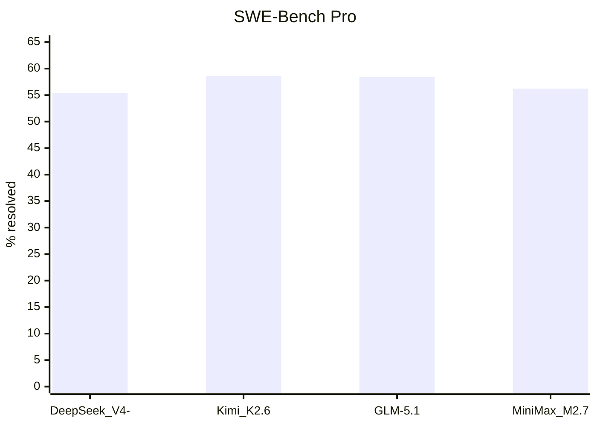
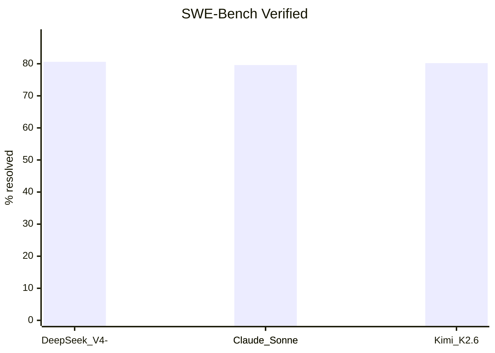
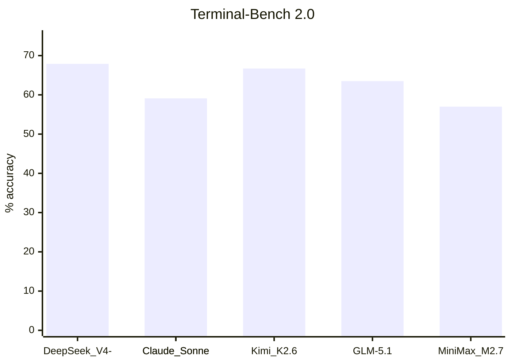
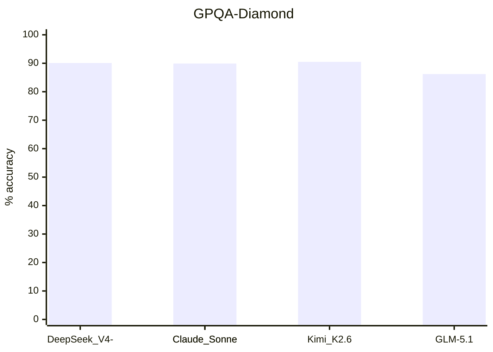
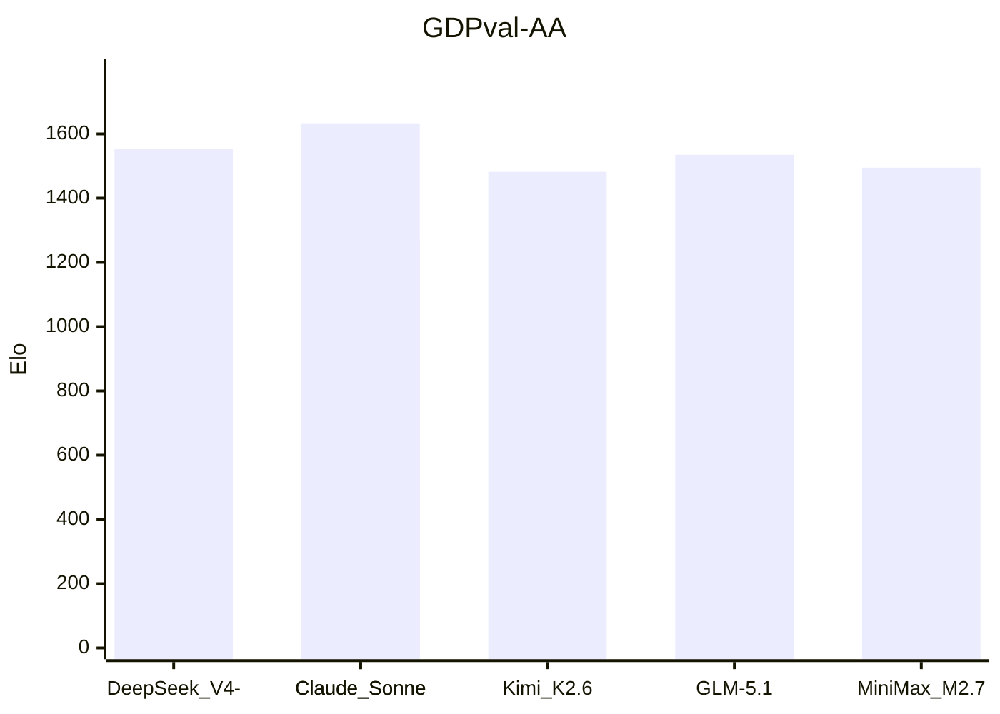
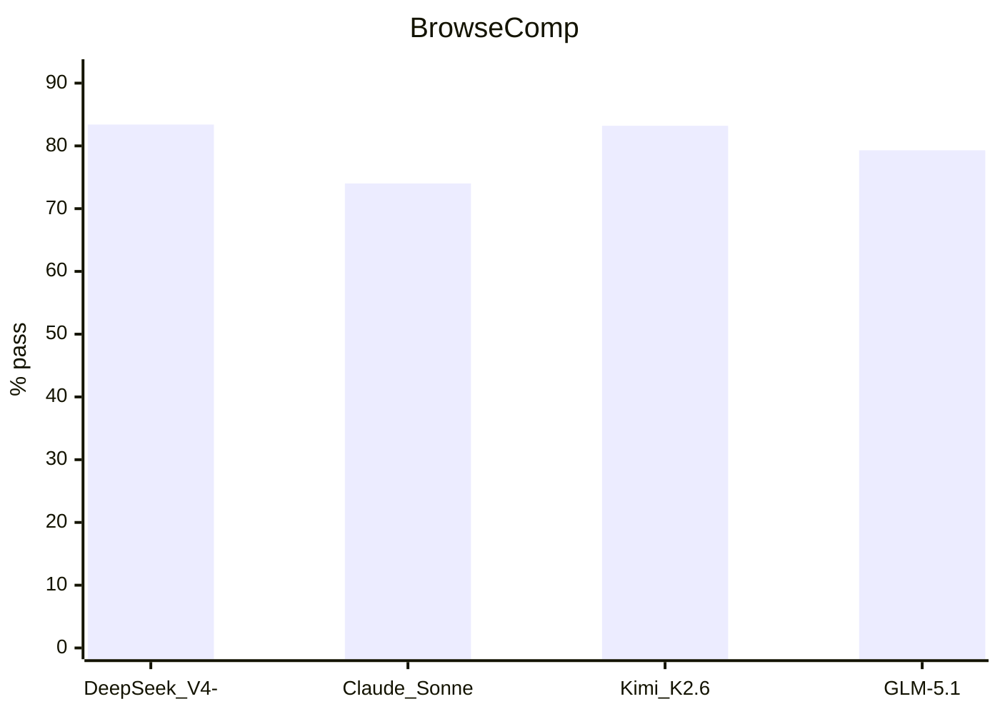
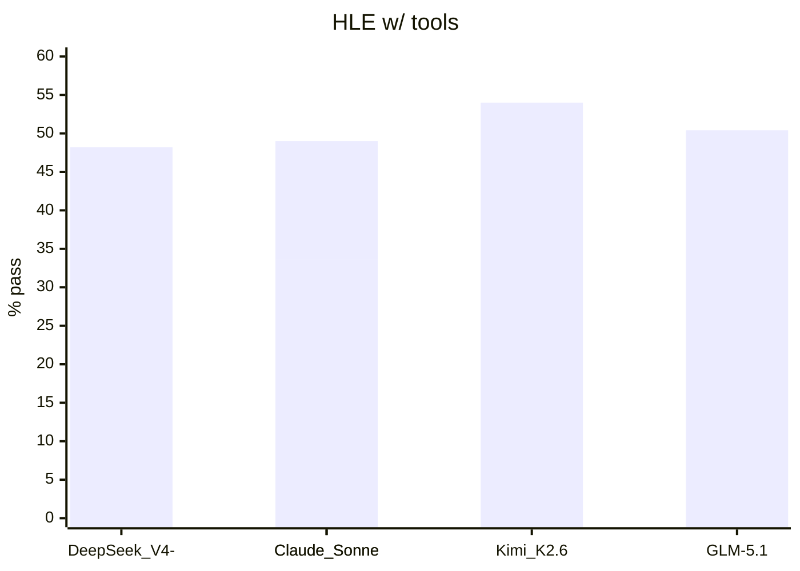

# AI Model Benchmark Comparison 2026 - Completed Research Report

Generated May 23, 2026. Exact sourced scores, closest equivalents, and not-publicly-reported entries are separated. DeepSeek V4-Pro Max is the maximum-reasoning-effort mode of DeepSeek V4-Pro, not a separate base model.

## Model Name Verification

| Requested label | Verified handling | Source |
|---|---|---|
| DeepSeek V4 Pro / V4 Pro Max | DeepSeek V4-Pro exists; V4-Pro-Max is maximum reasoning effort mode. | [S4] |
| Claude Sonnet 4.5 / 4.6 | Claude Sonnet 4.6 is the verified current Sonnet release in the source set; Sonnet 4.5 is included as predecessor comparison. | [S1][S2] |
| Kimi K2 / 2.6 | Kimi K2.6 is the verified release name in the source set. | [S3] |
| GLM-5.1 and GLM-4.7-Flash | GLM-5.1 benchmark data is available; GLM-4.7-Flash public benchmark matrix was not found in searched sources. | [S5][S9][S10] |
| Mid-tier GLM | No source confirmed a named mid-tier between GLM-5.1 and GLM-4.7-Flash; GLM-4.7 is included as closest non-Flash family member. | [S10] |
| MiniMax-2.7 | Public benchmark source uses MiniMax M2.7 naming. | [S6] |
| Le Mistral latest voice/all | Mistral docs list current model families and voice/audio product paths; no matching benchmark matrix was found for this uploaded benchmark set. | [S11][S12] |

## Model Naming And Trade-Off Notes

### DeepSeek V4-Pro Max
DeepSeek V4-Pro Max is reported as a maximum-reasoning-effort mode of DeepSeek V4-Pro. It is not treated as a separate base model in this report. The DeepSeek source also lists V4-Pro and V4-Flash with different total and activated parameter counts, so for DeepSeek the Flash label is tied to a smaller/lighter variant. [S4]

### Claude Sonnet
The verified current Sonnet release in the source set is Claude Sonnet 4.6. Claude Sonnet 4.5 is included as predecessor data where Anthropic reported the comparison. The report does not invent a Claude Sonnet 4.7 row. [S1][S2]

### Kimi K2.6
Moonshot's public model card uses Kimi K2.6 naming. The same source documents native multimodal capability, 256K context, and experimental video input through the official API. [S3]

### GLM Flash and mid-tier GLM
No searched GLM source confirmed a named mid-tier model between GLM-5.1 and GLM-4.7-Flash. GLM-4.7 is included only as the closest non-Flash family member. The searched GLM source did not confirm whether GLM-4.7-Flash is smaller, distilled, quantized, or only speed/cost optimized, so the report marks that detail unresolved instead of asserting it. [S9][S10]

### MiniMax M2.7
The public benchmark source uses MiniMax M2.7 naming. It reports coding, tool, and professional-work scores, but it does not provide a public voice or video benchmark matrix for M2.7 in the searched source set. [S6]

### Mistral latest voice/all
Mistral documentation identifies current model families and audio or voice product paths. The searched sources did not provide a benchmark matrix matching the uploaded benchmark rows for a single 'latest voice/all' Mistral model. [S11][S12]

## Claude Sonnet Detailed Score Inventory

| Model | Benchmark | Score | Source | Note |
|---|---|---|---|---|
| Claude Sonnet 4.5 | ARC-AGI-2 Verified | 13.6 | S1 | Anthropic Sonnet 4.6 system-card predecessor table. |
| Claude Sonnet 4.5 | GDPval-AA | 1276 | S1 | Anthropic Sonnet 4.6 system-card predecessor table. |
| Claude Sonnet 4.5 | GPQA-Diamond | 83.4 | S1 | Anthropic Sonnet 4.6 system-card predecessor table. |
| Claude Sonnet 4.5 | HLE | 17.7 | S1 | Anthropic Sonnet 4.6 system-card predecessor table. |
| Claude Sonnet 4.5 | HLE w/ tools | 33.6 | S1 | Anthropic Sonnet 4.6 system-card predecessor table. |
| Claude Sonnet 4.5 | MCP-Atlas Public | 43.8 | S1 | Anthropic Sonnet 4.6 system-card predecessor table. |
| Claude Sonnet 4.5 | MCPAtlas Public | 43.8 | S1 | Anthropic Sonnet 4.6 system-card predecessor table. |
| Claude Sonnet 4.5 | MMMLU | 89.5 | S1 | Anthropic Sonnet 4.6 system-card predecessor table. |
| Claude Sonnet 4.5 | MMMU-Pro | 63.4 | S1 | Anthropic Sonnet 4.6 system-card predecessor table. |
| Claude Sonnet 4.5 | MMMU-Pro w/ tools | 68.9 | S1 | Anthropic Sonnet 4.6 system-card predecessor table. |
| Claude Sonnet 4.5 | OSWorld-Verified | 61.4 | S1 | Anthropic Sonnet 4.6 system-card predecessor table. |
| Claude Sonnet 4.5 | SWE-Bench Verified | 77.2 | S1 | Anthropic Sonnet 4.6 system-card predecessor table. |
| Claude Sonnet 4.5 | Terminal-Bench 2.0 | 51.0 | S1 | Anthropic Sonnet 4.6 system-card predecessor table. |
| Claude Sonnet 4.6 | ARC-AGI-2 Verified | 58.3 | S1 | Anthropic Sonnet 4.6 system-card score. |
| Claude Sonnet 4.6 | BrowseComp | 74.01 | S1 | Anthropic Sonnet 4.6 system-card score. |
| Claude Sonnet 4.6 | Finance Agent | 63.3 | S1 | Anthropic Sonnet 4.6 system-card score. |
| Claude Sonnet 4.6 | GDPval-AA | 1633 | S1 | Anthropic Sonnet 4.6 system-card score. |
| Claude Sonnet 4.6 | GMMLU English | 92.9 | S1 | Anthropic Sonnet 4.6 system-card score. |
| Claude Sonnet 4.6 | GMMLU low-resource average | 83.8 | S1 | Anthropic Sonnet 4.6 system-card score. |
| Claude Sonnet 4.6 | GPQA-Diamond | 89.9 | S1 | Anthropic Sonnet 4.6 system-card score. |
| Claude Sonnet 4.6 | HLE | 33.2 | S1 | Anthropic Sonnet 4.6 system-card score. |
| Claude Sonnet 4.6 | HLE w/ tools | 49.0 | S1 | Anthropic Sonnet 4.6 system-card score. |
| Claude Sonnet 4.6 | MCP-Atlas Public | 61.3 | S1 | Anthropic Sonnet 4.6 system-card score. |
| Claude Sonnet 4.6 | MCPAtlas Public | 61.3 | S1 | Anthropic Sonnet 4.6 system-card score. |
| Claude Sonnet 4.6 | MILU average | 89.6 | S1 | Anthropic Sonnet 4.6 system-card score. |
| Claude Sonnet 4.6 | MMMLU | 89.3 | S1 | Anthropic Sonnet 4.6 system-card score. |
| Claude Sonnet 4.6 | MMMU-Pro | 74.5 | S1 | Anthropic Sonnet 4.6 system-card score. |
| Claude Sonnet 4.6 | MMMU-Pro w/ tools | 75.6 | S1 | Anthropic Sonnet 4.6 system-card score. |
| Claude Sonnet 4.6 | OSWorld-Verified | 72.5 | S1 | Anthropic Sonnet 4.6 system-card score. |
| Claude Sonnet 4.6 | SWE-Bench Multilingual | 75.9 | S1 | Anthropic Sonnet 4.6 system-card score. |
| Claude Sonnet 4.6 | SWE-Bench Verified | 79.6 | S1 | Anthropic Sonnet 4.6 system-card score. |
| Claude Sonnet 4.6 | Terminal-Bench 2.0 | 59.1 | S1 | Anthropic Sonnet 4.6 system-card score. |

## Benchmark Reference

### SWE-Bench Pro
SWE-Bench Pro measures whether an AI coding agent can resolve realistic software engineering issues in full repositories. A task requires reading code, making changes, running tests, and producing a patch that passes the benchmark validation. It matters because it is closer to maintenance work than short coding quizzes. Scores depend strongly on scaffold, tools, time budget, repository setup, and retry policy. A high score means strong multi-file debugging and code-repair ability under that harness. [S7][S13]

### Terminal-Bench 2.0
Terminal-Bench 2.0 measures command-line engineering: inspecting files, running shell commands, interpreting failures, editing code, and iterating. It is scored as pass rate or accuracy under a specified harness such as Terminus-2. It matters because real agents work in terminals. Resource limits, parsers, shell tools, and container behavior affect results. A high score means coherent computer-use execution in development environments. [S1][S14]

### GDPval
GDPval: This writing and knowledge benchmark row measures the model's ability to produce useful, accurate, and well-structured professional or factual outputs under the named harness. Some rows use human or model preference judgments; others use Elo-style ratings or exact-match exam scoring. It matters because broad knowledge and document quality are core production uses of frontier models. Limitations: score meaning depends on the evaluator, prompt set, rubric, tool policy, and whether the benchmark tests factual recall, judged usefulness, or domain-specific work product quality. A high score means stronger performance on that benchmark's rubric, not universal factual reliability. This report keeps GDPval separate from adjacent benchmark variants because similar names often hide different task pools, scoring rules, and tool policies. When an exact score was unavailable, the tables mark the cell as a closest equivalent or NR; closest-equivalent cells are traceability aids, not official scores for this row.

### OSWorld-Verified
OSWorld-Verified evaluates whether an AI can operate desktop apps through a visual computer interface. It is scored by task success. It matters for agents that click, type, and inspect screens. UI state, environment setup, and allowed tools influence results. A high score means better autonomous computer-use task completion. [S1][S20]

### Toolathlon
Toolathlon: This agentic benchmark row measures multi-step action under the named harness. Rows in this category include tool use, browsing, desktop control, context management, cybersecurity-style tasks, and capability markers such as context window or modality support. Scores are reported as pass rate, accuracy, Elo, or capability status depending on the benchmark. It matters because deployed agents must plan, call tools, inspect outputs, and recover from errors. Limitations: scaffolding, tools, browser environment, operating-system state, latency budget, and safety restrictions can dominate results. A high score means the tested model-plus-scaffold completed more tasks in that environment; it should not be read as a model-only property. This report keeps Toolathlon separate from adjacent benchmark variants because similar names often hide different task pools, scoring rules, and tool policies. When an exact score was unavailable, the tables mark the cell as a closest equivalent or NR; closest-equivalent cells are traceability aids, not official scores for this row.

### BrowseComp
BrowseComp measures hard web browsing and retrieval. The model must search, inspect sources, manage context, and return specific facts. It is scored as pass rate. Results depend on browser tools, context management, leakage filters, and scaffold. A high score means stronger web research behavior under the tested setup. [S1][S19]

### FrontierMath Tier 1-3
FrontierMath Tier 1-3: This reasoning benchmark row measures formal or semi-formal problem solving under the named test. Rows in this category cover graduate science questions, contest math, broad exam reasoning, and long-horizon expert problems. The score is reported in the unit shown in the table, most often percent accuracy or percent pass. It matters because these tests stress chain-of-thought control, knowledge retrieval, symbolic manipulation, and answer verification. Limitations: scores change with reasoning budget, tool allowance, sampling count, answer extraction, and contamination controls. A high score means stronger performance on the published reasoning distribution; it is not a guarantee of correctness on novel scientific, mathematical, legal, or safety-critical work. This report keeps FrontierMath Tier 1-3 separate from adjacent benchmark variants because similar names often hide different task pools, scoring rules, and tool policies. When an exact score was unavailable, the tables mark the cell as a closest equivalent or NR; closest-equivalent cells are traceability aids, not official scores for this row.

### FrontierMath Tier 4
FrontierMath Tier 4: This reasoning benchmark row measures formal or semi-formal problem solving under the named test. Rows in this category cover graduate science questions, contest math, broad exam reasoning, and long-horizon expert problems. The score is reported in the unit shown in the table, most often percent accuracy or percent pass. It matters because these tests stress chain-of-thought control, knowledge retrieval, symbolic manipulation, and answer verification. Limitations: scores change with reasoning budget, tool allowance, sampling count, answer extraction, and contamination controls. A high score means stronger performance on the published reasoning distribution; it is not a guarantee of correctness on novel scientific, mathematical, legal, or safety-critical work. This report keeps FrontierMath Tier 4 separate from adjacent benchmark variants because similar names often hide different task pools, scoring rules, and tool policies. When an exact score was unavailable, the tables mark the cell as a closest equivalent or NR; closest-equivalent cells are traceability aids, not official scores for this row.

### CyberGym
CyberGym: This agentic benchmark row measures multi-step action under the named harness. Rows in this category include tool use, browsing, desktop control, context management, cybersecurity-style tasks, and capability markers such as context window or modality support. Scores are reported as pass rate, accuracy, Elo, or capability status depending on the benchmark. It matters because deployed agents must plan, call tools, inspect outputs, and recover from errors. Limitations: scaffolding, tools, browser environment, operating-system state, latency budget, and safety restrictions can dominate results. A high score means the tested model-plus-scaffold completed more tasks in that environment; it should not be read as a model-only property. This report keeps CyberGym separate from adjacent benchmark variants because similar names often hide different task pools, scoring rules, and tool policies. When an exact score was unavailable, the tables mark the cell as a closest equivalent or NR; closest-equivalent cells are traceability aids, not official scores for this row.

### SWE-Lancer IC Diamond
SWE-Lancer IC Diamond: This coding benchmark row measures software construction, repair, or program synthesis under the named harness. Depending on the row, the model may need to solve a short algorithmic task, modify a repository, operate a terminal, infer a repository from natural language, or pass hidden tests. The score is reported in the unit shown in the table, usually percent resolved, percent pass, or percent accuracy. It matters because coding benchmarks separate short-form code fluency from multi-step engineering execution. Limitations: results depend on scaffold, tool access, retry policy, private tests, package installation, execution time, and whether the task distribution overlaps training data. A high score means the model was more reliable on that exact benchmark setup; it does not prove equal performance on every programming language, repository, or production workflow. This report keeps SWE-Lancer IC Diamond separate from adjacent benchmark variants because similar names often hide different task pools, scoring rules, and tool policies. When an exact score was unavailable, the tables mark the cell as a closest equivalent or NR; closest-equivalent cells are traceability aids, not official scores for this row.

### SWE-Bench Verified
SWE-Bench Verified is a human-validated subset of SWE-bench. It keeps real GitHub issues but filters for tasks that humans checked as fair and solvable. Scoring is percent resolved after the generated patch is tested. It matters because it reduces noise in repository-repair measurement. Limitations include Python/project bias and scaffold sensitivity. A high score means practical bug-fixing skill with the tested agent setup. [S1][S13]

### GPQA-Diamond
GPQA-Diamond contains difficult graduate-level science questions filtered to be hard for non-experts. Scores are usually accuracy or pass@1. It matters because it probes factual reasoning in scientific domains. It is sensitive to prompting, tool policy, and reasoning effort. A high score means strong expert-style science reasoning under the tested setup, not guaranteed scientific reliability. [S1][S15]

### AIME 2026
AIME 2026: This reasoning benchmark row measures formal or semi-formal problem solving under the named test. Rows in this category cover graduate science questions, contest math, broad exam reasoning, and long-horizon expert problems. The score is reported in the unit shown in the table, most often percent accuracy or percent pass. It matters because these tests stress chain-of-thought control, knowledge retrieval, symbolic manipulation, and answer verification. Limitations: scores change with reasoning budget, tool allowance, sampling count, answer extraction, and contamination controls. A high score means stronger performance on the published reasoning distribution; it is not a guarantee of correctness on novel scientific, mathematical, legal, or safety-critical work. This report keeps AIME 2026 separate from adjacent benchmark variants because similar names often hide different task pools, scoring rules, and tool policies. When an exact score was unavailable, the tables mark the cell as a closest equivalent or NR; closest-equivalent cells are traceability aids, not official scores for this row.

### GDPval-AA
GDPval-AA evaluates economically valuable knowledge work and is commonly reported as Elo. It covers professional outputs such as finance, legal, documents, spreadsheets, and analysis. Elo must not be mixed with percent-accuracy metrics. A high score means stronger judged output quality on that professional-work distribution. [S1][S8]

### MCP-Atlas Public
MCP-Atlas Public: This agentic benchmark row measures multi-step action under the named harness. Rows in this category include tool use, browsing, desktop control, context management, cybersecurity-style tasks, and capability markers such as context window or modality support. Scores are reported as pass rate, accuracy, Elo, or capability status depending on the benchmark. It matters because deployed agents must plan, call tools, inspect outputs, and recover from errors. Limitations: scaffolding, tools, browser environment, operating-system state, latency budget, and safety restrictions can dominate results. A high score means the tested model-plus-scaffold completed more tasks in that environment; it should not be read as a model-only property. This report keeps MCP-Atlas Public separate from adjacent benchmark variants because similar names often hide different task pools, scoring rules, and tool policies. When an exact score was unavailable, the tables mark the cell as a closest equivalent or NR; closest-equivalent cells are traceability aids, not official scores for this row.

### HLE w/ tools
Humanity Last Exam with tools adds search, code, web, or similar external tools depending on source. It measures tool-augmented research and reasoning. Scores are not directly comparable with no-tool HLE. A high score means better model-plus-tool research-agent performance. [S1][S3][S4][S18]

### VIBE-Pro
VIBE-Pro: This coding benchmark row measures software construction, repair, or program synthesis under the named harness. Depending on the row, the model may need to solve a short algorithmic task, modify a repository, operate a terminal, infer a repository from natural language, or pass hidden tests. The score is reported in the unit shown in the table, usually percent resolved, percent pass, or percent accuracy. It matters because coding benchmarks separate short-form code fluency from multi-step engineering execution. Limitations: results depend on scaffold, tool access, retry policy, private tests, package installation, execution time, and whether the task distribution overlaps training data. A high score means the model was more reliable on that exact benchmark setup; it does not prove equal performance on every programming language, repository, or production workflow. This report keeps VIBE-Pro separate from adjacent benchmark variants because similar names often hide different task pools, scoring rules, and tool policies. When an exact score was unavailable, the tables mark the cell as a closest equivalent or NR; closest-equivalent cells are traceability aids, not official scores for this row.

### NL2Repo
NL2Repo: This coding benchmark row measures software construction, repair, or program synthesis under the named harness. Depending on the row, the model may need to solve a short algorithmic task, modify a repository, operate a terminal, infer a repository from natural language, or pass hidden tests. The score is reported in the unit shown in the table, usually percent resolved, percent pass, or percent accuracy. It matters because coding benchmarks separate short-form code fluency from multi-step engineering execution. Limitations: results depend on scaffold, tool access, retry policy, private tests, package installation, execution time, and whether the task distribution overlaps training data. A high score means the model was more reliable on that exact benchmark setup; it does not prove equal performance on every programming language, repository, or production workflow. This report keeps NL2Repo separate from adjacent benchmark variants because similar names often hide different task pools, scoring rules, and tool policies. When an exact score was unavailable, the tables mark the cell as a closest equivalent or NR; closest-equivalent cells are traceability aids, not official scores for this row.

### MM Claw
MM Claw: This agentic benchmark row measures multi-step action under the named harness. Rows in this category include tool use, browsing, desktop control, context management, cybersecurity-style tasks, and capability markers such as context window or modality support. Scores are reported as pass rate, accuracy, Elo, or capability status depending on the benchmark. It matters because deployed agents must plan, call tools, inspect outputs, and recover from errors. Limitations: scaffolding, tools, browser environment, operating-system state, latency budget, and safety restrictions can dominate results. A high score means the tested model-plus-scaffold completed more tasks in that environment; it should not be read as a model-only property. This report keeps MM Claw separate from adjacent benchmark variants because similar names often hide different task pools, scoring rules, and tool policies. When an exact score was unavailable, the tables mark the cell as a closest equivalent or NR; closest-equivalent cells are traceability aids, not official scores for this row.

### MLE Bench Lite
MLE Bench Lite: This agentic benchmark row measures multi-step action under the named harness. Rows in this category include tool use, browsing, desktop control, context management, cybersecurity-style tasks, and capability markers such as context window or modality support. Scores are reported as pass rate, accuracy, Elo, or capability status depending on the benchmark. It matters because deployed agents must plan, call tools, inspect outputs, and recover from errors. Limitations: scaffolding, tools, browser environment, operating-system state, latency budget, and safety restrictions can dominate results. A high score means the tested model-plus-scaffold completed more tasks in that environment; it should not be read as a model-only property. This report keeps MLE Bench Lite separate from adjacent benchmark variants because similar names often hide different task pools, scoring rules, and tool policies. When an exact score was unavailable, the tables mark the cell as a closest equivalent or NR; closest-equivalent cells are traceability aids, not official scores for this row.

### SWE-Bench Multilingual
SWE-Bench Multilingual: This coding benchmark row measures software construction, repair, or program synthesis under the named harness. Depending on the row, the model may need to solve a short algorithmic task, modify a repository, operate a terminal, infer a repository from natural language, or pass hidden tests. The score is reported in the unit shown in the table, usually percent resolved, percent pass, or percent accuracy. It matters because coding benchmarks separate short-form code fluency from multi-step engineering execution. Limitations: results depend on scaffold, tool access, retry policy, private tests, package installation, execution time, and whether the task distribution overlaps training data. A high score means the model was more reliable on that exact benchmark setup; it does not prove equal performance on every programming language, repository, or production workflow. This report keeps SWE-Bench Multilingual separate from adjacent benchmark variants because similar names often hide different task pools, scoring rules, and tool policies. When an exact score was unavailable, the tables mark the cell as a closest equivalent or NR; closest-equivalent cells are traceability aids, not official scores for this row.

### Multi SWE Bench
Multi SWE Bench: This coding benchmark row measures software construction, repair, or program synthesis under the named harness. Depending on the row, the model may need to solve a short algorithmic task, modify a repository, operate a terminal, infer a repository from natural language, or pass hidden tests. The score is reported in the unit shown in the table, usually percent resolved, percent pass, or percent accuracy. It matters because coding benchmarks separate short-form code fluency from multi-step engineering execution. Limitations: results depend on scaffold, tool access, retry policy, private tests, package installation, execution time, and whether the task distribution overlaps training data. A high score means the model was more reliable on that exact benchmark setup; it does not prove equal performance on every programming language, repository, or production workflow. This report keeps Multi SWE Bench separate from adjacent benchmark variants because similar names often hide different task pools, scoring rules, and tool policies. When an exact score was unavailable, the tables mark the cell as a closest equivalent or NR; closest-equivalent cells are traceability aids, not official scores for this row.

### DeepSearchQA
DeepSearchQA: This agentic benchmark row measures multi-step action under the named harness. Rows in this category include tool use, browsing, desktop control, context management, cybersecurity-style tasks, and capability markers such as context window or modality support. Scores are reported as pass rate, accuracy, Elo, or capability status depending on the benchmark. It matters because deployed agents must plan, call tools, inspect outputs, and recover from errors. Limitations: scaffolding, tools, browser environment, operating-system state, latency budget, and safety restrictions can dominate results. A high score means the tested model-plus-scaffold completed more tasks in that environment; it should not be read as a model-only property. This report keeps DeepSearchQA separate from adjacent benchmark variants because similar names often hide different task pools, scoring rules, and tool policies. When an exact score was unavailable, the tables mark the cell as a closest equivalent or NR; closest-equivalent cells are traceability aids, not official scores for this row.

### SciCode
SciCode: This coding benchmark row measures software construction, repair, or program synthesis under the named harness. Depending on the row, the model may need to solve a short algorithmic task, modify a repository, operate a terminal, infer a repository from natural language, or pass hidden tests. The score is reported in the unit shown in the table, usually percent resolved, percent pass, or percent accuracy. It matters because coding benchmarks separate short-form code fluency from multi-step engineering execution. Limitations: results depend on scaffold, tool access, retry policy, private tests, package installation, execution time, and whether the task distribution overlaps training data. A high score means the model was more reliable on that exact benchmark setup; it does not prove equal performance on every programming language, repository, or production workflow. This report keeps SciCode separate from adjacent benchmark variants because similar names often hide different task pools, scoring rules, and tool policies. When an exact score was unavailable, the tables mark the cell as a closest equivalent or NR; closest-equivalent cells are traceability aids, not official scores for this row.

### OJBench Python
OJBench Python: This coding benchmark row measures software construction, repair, or program synthesis under the named harness. Depending on the row, the model may need to solve a short algorithmic task, modify a repository, operate a terminal, infer a repository from natural language, or pass hidden tests. The score is reported in the unit shown in the table, usually percent resolved, percent pass, or percent accuracy. It matters because coding benchmarks separate short-form code fluency from multi-step engineering execution. Limitations: results depend on scaffold, tool access, retry policy, private tests, package installation, execution time, and whether the task distribution overlaps training data. A high score means the model was more reliable on that exact benchmark setup; it does not prove equal performance on every programming language, repository, or production workflow. This report keeps OJBench Python separate from adjacent benchmark variants because similar names often hide different task pools, scoring rules, and tool policies. When an exact score was unavailable, the tables mark the cell as a closest equivalent or NR; closest-equivalent cells are traceability aids, not official scores for this row.

### LiveCodeBench v6
LiveCodeBench evaluates code generation on fresh programming problems designed to reduce leakage. It is scored as pass rate against tests. It measures algorithmic programming, not repository repair. A high score means strong problem decomposition and implementation correctness under the benchmark prompt and sampling setup. [S3][S4][S17]

### HLE
Humanity Last Exam is a broad hard benchmark across many disciplines. It is designed to stay difficult for frontier models and is scored as pass rate or accuracy. Exact subset, tools, and decontamination policy matter. A high score means strong broad expert reasoning under the reported setup. [S1][S18]

### HMMT 2026 Feb
HMMT 2026 Feb: This reasoning benchmark row measures formal or semi-formal problem solving under the named test. Rows in this category cover graduate science questions, contest math, broad exam reasoning, and long-horizon expert problems. The score is reported in the unit shown in the table, most often percent accuracy or percent pass. It matters because these tests stress chain-of-thought control, knowledge retrieval, symbolic manipulation, and answer verification. Limitations: scores change with reasoning budget, tool allowance, sampling count, answer extraction, and contamination controls. A high score means stronger performance on the published reasoning distribution; it is not a guarantee of correctness on novel scientific, mathematical, legal, or safety-critical work. This report keeps HMMT 2026 Feb separate from adjacent benchmark variants because similar names often hide different task pools, scoring rules, and tool policies. When an exact score was unavailable, the tables mark the cell as a closest equivalent or NR; closest-equivalent cells are traceability aids, not official scores for this row.

### IMO-AnswerBench
IMO-AnswerBench: This reasoning benchmark row measures formal or semi-formal problem solving under the named test. Rows in this category cover graduate science questions, contest math, broad exam reasoning, and long-horizon expert problems. The score is reported in the unit shown in the table, most often percent accuracy or percent pass. It matters because these tests stress chain-of-thought control, knowledge retrieval, symbolic manipulation, and answer verification. Limitations: scores change with reasoning budget, tool allowance, sampling count, answer extraction, and contamination controls. A high score means stronger performance on the published reasoning distribution; it is not a guarantee of correctness on novel scientific, mathematical, legal, or safety-critical work. This report keeps IMO-AnswerBench separate from adjacent benchmark variants because similar names often hide different task pools, scoring rules, and tool policies. When an exact score was unavailable, the tables mark the cell as a closest equivalent or NR; closest-equivalent cells are traceability aids, not official scores for this row.

### MMLU-Pro
MMLU-Pro hardens MMLU with more difficult multi-option questions and stronger reasoning demands across academic and professional subjects. It is scored as exact match or accuracy. It matters because old MMLU is saturated. It remains a static exam benchmark. A high score means broad knowledge and reasoning robustness, not full task competence. [S4][S16]

### SimpleQA-Verified
SimpleQA-Verified: This reasoning benchmark row measures formal or semi-formal problem solving under the named test. Rows in this category cover graduate science questions, contest math, broad exam reasoning, and long-horizon expert problems. The score is reported in the unit shown in the table, most often percent accuracy or percent pass. It matters because these tests stress chain-of-thought control, knowledge retrieval, symbolic manipulation, and answer verification. Limitations: scores change with reasoning budget, tool allowance, sampling count, answer extraction, and contamination controls. A high score means stronger performance on the published reasoning distribution; it is not a guarantee of correctness on novel scientific, mathematical, legal, or safety-critical work. This report keeps SimpleQA-Verified separate from adjacent benchmark variants because similar names often hide different task pools, scoring rules, and tool policies. When an exact score was unavailable, the tables mark the cell as a closest equivalent or NR; closest-equivalent cells are traceability aids, not official scores for this row.

### Codeforces
Codeforces: This reasoning benchmark row measures formal or semi-formal problem solving under the named test. Rows in this category cover graduate science questions, contest math, broad exam reasoning, and long-horizon expert problems. The score is reported in the unit shown in the table, most often percent accuracy or percent pass. It matters because these tests stress chain-of-thought control, knowledge retrieval, symbolic manipulation, and answer verification. Limitations: scores change with reasoning budget, tool allowance, sampling count, answer extraction, and contamination controls. A high score means stronger performance on the published reasoning distribution; it is not a guarantee of correctness on novel scientific, mathematical, legal, or safety-critical work. This report keeps Codeforces separate from adjacent benchmark variants because similar names often hide different task pools, scoring rules, and tool policies. When an exact score was unavailable, the tables mark the cell as a closest equivalent or NR; closest-equivalent cells are traceability aids, not official scores for this row.

### MCPAtlas Public
MCPAtlas Public: This agentic benchmark row measures multi-step action under the named harness. Rows in this category include tool use, browsing, desktop control, context management, cybersecurity-style tasks, and capability markers such as context window or modality support. Scores are reported as pass rate, accuracy, Elo, or capability status depending on the benchmark. It matters because deployed agents must plan, call tools, inspect outputs, and recover from errors. Limitations: scaffolding, tools, browser environment, operating-system state, latency budget, and safety restrictions can dominate results. A high score means the tested model-plus-scaffold completed more tasks in that environment; it should not be read as a model-only property. This report keeps MCPAtlas Public separate from adjacent benchmark variants because similar names often hide different task pools, scoring rules, and tool policies. When an exact score was unavailable, the tables mark the cell as a closest equivalent or NR; closest-equivalent cells are traceability aids, not official scores for this row.

### HumanEval
HumanEval: This coding benchmark row measures software construction, repair, or program synthesis under the named harness. Depending on the row, the model may need to solve a short algorithmic task, modify a repository, operate a terminal, infer a repository from natural language, or pass hidden tests. The score is reported in the unit shown in the table, usually percent resolved, percent pass, or percent accuracy. It matters because coding benchmarks separate short-form code fluency from multi-step engineering execution. Limitations: results depend on scaffold, tool access, retry policy, private tests, package installation, execution time, and whether the task distribution overlaps training data. A high score means the model was more reliable on that exact benchmark setup; it does not prove equal performance on every programming language, repository, or production workflow. This report keeps HumanEval separate from adjacent benchmark variants because similar names often hide different task pools, scoring rules, and tool policies. When an exact score was unavailable, the tables mark the cell as a closest equivalent or NR; closest-equivalent cells are traceability aids, not official scores for this row.

### GSM8K
GSM8K: This reasoning benchmark row measures formal or semi-formal problem solving under the named test. Rows in this category cover graduate science questions, contest math, broad exam reasoning, and long-horizon expert problems. The score is reported in the unit shown in the table, most often percent accuracy or percent pass. It matters because these tests stress chain-of-thought control, knowledge retrieval, symbolic manipulation, and answer verification. Limitations: scores change with reasoning budget, tool allowance, sampling count, answer extraction, and contamination controls. A high score means stronger performance on the published reasoning distribution; it is not a guarantee of correctness on novel scientific, mathematical, legal, or safety-critical work. This report keeps GSM8K separate from adjacent benchmark variants because similar names often hide different task pools, scoring rules, and tool policies. When an exact score was unavailable, the tables mark the cell as a closest equivalent or NR; closest-equivalent cells are traceability aids, not official scores for this row.

### MATH
MATH: This reasoning benchmark row measures formal or semi-formal problem solving under the named test. Rows in this category cover graduate science questions, contest math, broad exam reasoning, and long-horizon expert problems. The score is reported in the unit shown in the table, most often percent accuracy or percent pass. It matters because these tests stress chain-of-thought control, knowledge retrieval, symbolic manipulation, and answer verification. Limitations: scores change with reasoning budget, tool allowance, sampling count, answer extraction, and contamination controls. A high score means stronger performance on the published reasoning distribution; it is not a guarantee of correctness on novel scientific, mathematical, legal, or safety-critical work. This report keeps MATH separate from adjacent benchmark variants because similar names often hide different task pools, scoring rules, and tool policies. When an exact score was unavailable, the tables mark the cell as a closest equivalent or NR; closest-equivalent cells are traceability aids, not official scores for this row.

### HMMT 2025 Nov
HMMT 2025 Nov: This reasoning benchmark row measures formal or semi-formal problem solving under the named test. Rows in this category cover graduate science questions, contest math, broad exam reasoning, and long-horizon expert problems. The score is reported in the unit shown in the table, most often percent accuracy or percent pass. It matters because these tests stress chain-of-thought control, knowledge retrieval, symbolic manipulation, and answer verification. Limitations: scores change with reasoning budget, tool allowance, sampling count, answer extraction, and contamination controls. A high score means stronger performance on the published reasoning distribution; it is not a guarantee of correctness on novel scientific, mathematical, legal, or safety-critical work. This report keeps HMMT 2025 Nov separate from adjacent benchmark variants because similar names often hide different task pools, scoring rules, and tool policies. When an exact score was unavailable, the tables mark the cell as a closest equivalent or NR; closest-equivalent cells are traceability aids, not official scores for this row.

### BrowseComp w/ context management
BrowseComp w/ context management: This agentic benchmark row measures multi-step action under the named harness. Rows in this category include tool use, browsing, desktop control, context management, cybersecurity-style tasks, and capability markers such as context window or modality support. Scores are reported as pass rate, accuracy, Elo, or capability status depending on the benchmark. It matters because deployed agents must plan, call tools, inspect outputs, and recover from errors. Limitations: scaffolding, tools, browser environment, operating-system state, latency budget, and safety restrictions can dominate results. A high score means the tested model-plus-scaffold completed more tasks in that environment; it should not be read as a model-only property. This report keeps BrowseComp w/ context management separate from adjacent benchmark variants because similar names often hide different task pools, scoring rules, and tool policies. When an exact score was unavailable, the tables mark the cell as a closest equivalent or NR; closest-equivalent cells are traceability aids, not official scores for this row.

### Tool-Decathlon
Tool-Decathlon: This agentic benchmark row measures multi-step action under the named harness. Rows in this category include tool use, browsing, desktop control, context management, cybersecurity-style tasks, and capability markers such as context window or modality support. Scores are reported as pass rate, accuracy, Elo, or capability status depending on the benchmark. It matters because deployed agents must plan, call tools, inspect outputs, and recover from errors. Limitations: scaffolding, tools, browser environment, operating-system state, latency budget, and safety restrictions can dominate results. A high score means the tested model-plus-scaffold completed more tasks in that environment; it should not be read as a model-only property. This report keeps Tool-Decathlon separate from adjacent benchmark variants because similar names often hide different task pools, scoring rules, and tool policies. When an exact score was unavailable, the tables mark the cell as a closest equivalent or NR; closest-equivalent cells are traceability aids, not official scores for this row.

### tau3-Bench
tau3-Bench: This agentic benchmark row measures multi-step action under the named harness. Rows in this category include tool use, browsing, desktop control, context management, cybersecurity-style tasks, and capability markers such as context window or modality support. Scores are reported as pass rate, accuracy, Elo, or capability status depending on the benchmark. It matters because deployed agents must plan, call tools, inspect outputs, and recover from errors. Limitations: scaffolding, tools, browser environment, operating-system state, latency budget, and safety restrictions can dominate results. A high score means the tested model-plus-scaffold completed more tasks in that environment; it should not be read as a model-only property. This report keeps tau3-Bench separate from adjacent benchmark variants because similar names often hide different task pools, scoring rules, and tool policies. When an exact score was unavailable, the tables mark the cell as a closest equivalent or NR; closest-equivalent cells are traceability aids, not official scores for this row.

### Video input support
Video input support is a capability marker, not a score. It records whether public documentation says the model can accept video input. It matters for demos, screen recordings, visual sequences, and multimodal workflows. It does not measure quality or latency. Supported means the feature is documented; NR means no comparable public benchmark was found. [S3][S11][S12]

### Voice/audio support
Voice/audio support is a capability marker, not a score. It records documented speech, audio, voice input/output, or voice workflow support. It matters for conversational products, accessibility, call-center work, and multimodal agents. It does not prove voice quality. Supported means documentation exists; NR means no comparable public score was found. [S11][S12]

### Context window
Context window records maximum documented token context. It matters for large repositories, many documents, and long research sessions. It does not prove perfect use of all tokens. Retrieval quality, attention behavior, latency, and cost still matter. A high value means the model can accept more tokens in the documented deployment. [S3][S4][S5]

### ARC-AGI-2 Verified
ARC-AGI-2 Verified: This reasoning benchmark row measures formal or semi-formal problem solving under the named test. Rows in this category cover graduate science questions, contest math, broad exam reasoning, and long-horizon expert problems. The score is reported in the unit shown in the table, most often percent accuracy or percent pass. It matters because these tests stress chain-of-thought control, knowledge retrieval, symbolic manipulation, and answer verification. Limitations: scores change with reasoning budget, tool allowance, sampling count, answer extraction, and contamination controls. A high score means stronger performance on the published reasoning distribution; it is not a guarantee of correctness on novel scientific, mathematical, legal, or safety-critical work. This report keeps ARC-AGI-2 Verified separate from adjacent benchmark variants because similar names often hide different task pools, scoring rules, and tool policies. When an exact score was unavailable, the tables mark the cell as a closest equivalent or NR; closest-equivalent cells are traceability aids, not official scores for this row.

### MMMLU
MMMLU: This writing and knowledge benchmark row measures the model's ability to produce useful, accurate, and well-structured professional or factual outputs under the named harness. Some rows use human or model preference judgments; others use Elo-style ratings or exact-match exam scoring. It matters because broad knowledge and document quality are core production uses of frontier models. Limitations: score meaning depends on the evaluator, prompt set, rubric, tool policy, and whether the benchmark tests factual recall, judged usefulness, or domain-specific work product quality. A high score means stronger performance on that benchmark's rubric, not universal factual reliability. This report keeps MMMLU separate from adjacent benchmark variants because similar names often hide different task pools, scoring rules, and tool policies. When an exact score was unavailable, the tables mark the cell as a closest equivalent or NR; closest-equivalent cells are traceability aids, not official scores for this row.

### GMMLU English
GMMLU English: This multilingual benchmark row measures performance across languages or language-specific knowledge distributions. It is scored in the unit shown in the table, typically percent accuracy. It matters because multilingual deployment requires robust comprehension and generation beyond English, including low-resource language handling. Limitations: language mix, translation artifacts, cultural coverage, prompt language, and answer normalization can shift scores. A high score means stronger performance on the tested language set; it does not prove equal fluency, safety, or cultural competence in every language. This report keeps GMMLU English separate from adjacent benchmark variants because similar names often hide different task pools, scoring rules, and tool policies. When an exact score was unavailable, the tables mark the cell as a closest equivalent or NR; closest-equivalent cells are traceability aids, not official scores for this row.

### GMMLU low-resource average
GMMLU low-resource average: This multilingual benchmark row measures performance across languages or language-specific knowledge distributions. It is scored in the unit shown in the table, typically percent accuracy. It matters because multilingual deployment requires robust comprehension and generation beyond English, including low-resource language handling. Limitations: language mix, translation artifacts, cultural coverage, prompt language, and answer normalization can shift scores. A high score means stronger performance on the tested language set; it does not prove equal fluency, safety, or cultural competence in every language. This report keeps GMMLU low-resource average separate from adjacent benchmark variants because similar names often hide different task pools, scoring rules, and tool policies. When an exact score was unavailable, the tables mark the cell as a closest equivalent or NR; closest-equivalent cells are traceability aids, not official scores for this row.

### MILU average
MILU average: This multilingual benchmark row measures performance across languages or language-specific knowledge distributions. It is scored in the unit shown in the table, typically percent accuracy. It matters because multilingual deployment requires robust comprehension and generation beyond English, including low-resource language handling. Limitations: language mix, translation artifacts, cultural coverage, prompt language, and answer normalization can shift scores. A high score means stronger performance on the tested language set; it does not prove equal fluency, safety, or cultural competence in every language. This report keeps MILU average separate from adjacent benchmark variants because similar names often hide different task pools, scoring rules, and tool policies. When an exact score was unavailable, the tables mark the cell as a closest equivalent or NR; closest-equivalent cells are traceability aids, not official scores for this row.

### Finance Agent
Finance Agent: This writing and knowledge benchmark row measures the model's ability to produce useful, accurate, and well-structured professional or factual outputs under the named harness. Some rows use human or model preference judgments; others use Elo-style ratings or exact-match exam scoring. It matters because broad knowledge and document quality are core production uses of frontier models. Limitations: score meaning depends on the evaluator, prompt set, rubric, tool policy, and whether the benchmark tests factual recall, judged usefulness, or domain-specific work product quality. A high score means stronger performance on that benchmark's rubric, not universal factual reliability. This report keeps Finance Agent separate from adjacent benchmark variants because similar names often hide different task pools, scoring rules, and tool policies. When an exact score was unavailable, the tables mark the cell as a closest equivalent or NR; closest-equivalent cells are traceability aids, not official scores for this row.

### MMMU-Pro
MMMU-Pro: This vision benchmark row measures multimodal reasoning over images or visual documents under the named harness. It is scored in the unit shown in the table, usually percent accuracy or pass rate. It matters because multimodal models must read charts, diagrams, screenshots, documents, and photographs rather than plain text only. Limitations: image resolution, crop policy, tool use, OCR quality, prompt wording, and answer normalization strongly affect results. A high score means better visual reasoning in the benchmark setup; it does not prove robust perception across all real-world visual inputs. This report keeps MMMU-Pro separate from adjacent benchmark variants because similar names often hide different task pools, scoring rules, and tool policies. When an exact score was unavailable, the tables mark the cell as a closest equivalent or NR; closest-equivalent cells are traceability aids, not official scores for this row.

### MMMU-Pro w/ tools
MMMU-Pro w/ tools: This vision benchmark row measures multimodal reasoning over images or visual documents under the named harness. It is scored in the unit shown in the table, usually percent accuracy or pass rate. It matters because multimodal models must read charts, diagrams, screenshots, documents, and photographs rather than plain text only. Limitations: image resolution, crop policy, tool use, OCR quality, prompt wording, and answer normalization strongly affect results. A high score means better visual reasoning in the benchmark setup; it does not prove robust perception across all real-world visual inputs. This report keeps MMMU-Pro w/ tools separate from adjacent benchmark variants because similar names often hide different task pools, scoring rules, and tool policies. When an exact score was unavailable, the tables mark the cell as a closest equivalent or NR; closest-equivalent cells are traceability aids, not official scores for this row.

## Master Results Table

| Category | Benchmark | Unit | DeepSeek V4-Pro Base | DeepSeek V4-Pro Max | Claude Sonnet 4.6 | Claude Sonnet 4.5 | Kimi K2.6 | GLM-5.1 | GLM-4.7 | GLM-4.7-Flash | MiniMax M2.7 | Mistral Latest (documented) |
|---|---|---|---|---|---|---|---|---|---|---|---|---|
| Coding | SWE-Bench Pro | % resolved | Closest: HumanEval=76.8 | 55.4 | Closest: SWE-Bench Verified=79.6 | Closest: SWE-Bench Verified=77.2 | 58.6 | 58.4 | NR | NR | 56.22 | NR |
| Coding | Terminal-Bench 2.0 | % accuracy | Closest: HumanEval=76.8 | 67.9 | 59.1 | 51.0 | 66.7 | 63.5 | NR | NR | 57.0 | NR |
| Writing & Knowledge | GDPval | % wins or ties | NR | Closest: GDPval-AA=1554 | Closest: GDPval-AA=1633 | Closest: MMMLU=89.5 | Closest: GDPval-AA=1482 | Closest: GDPval-AA=1535 | NR | NR | Closest: GDPval-AA=1495 | NR |
| Agentic & Other | OSWorld-Verified | % success | Closest: Context window=1000000 | Closest: BrowseComp=83.4 | 72.5 | 61.4 | 73.1 | Closest: CyberGym=68.7 | NR | NR | Closest: Toolathlon=46.3 | NR |
| Agentic & Other | Toolathlon | % pass | Closest: Context window=1000000 | 51.8 | Closest: MCP-Atlas Public=61.3 | Closest: MCP-Atlas Public=43.8 | 50 | Closest: CyberGym=68.7 | NR | NR | 46.3 | NR |
| Agentic & Other | BrowseComp | % pass | Closest: Context window=1000000 | 83.4 | 74.01 | Closest: MCP-Atlas Public=43.8 | 83.2 | 79.3 | NR | NR | Closest: Toolathlon=46.3 | NR |
| Math & Reasoning | FrontierMath Tier 1-3 | % pass | Closest: MMLU-Pro=73.5 | Closest: MMLU-Pro=87.5 | Closest: ARC-AGI-2 Verified=58.3 | Closest: ARC-AGI-2 Verified=13.6 | Closest: HLE=34.7 | Closest: AIME 2026=95.3 | NR | NR | NR | NR |
| Math & Reasoning | FrontierMath Tier 4 | % pass | Closest: MMLU-Pro=73.5 | Closest: MMLU-Pro=87.5 | Closest: ARC-AGI-2 Verified=58.3 | Closest: ARC-AGI-2 Verified=13.6 | Closest: HLE=34.7 | Closest: AIME 2026=95.3 | NR | NR | NR | NR |
| Agentic & Other | CyberGym | % score | Closest: Context window=1000000 | Closest: BrowseComp=83.4 | Closest: MCP-Atlas Public=61.3 | Closest: MCP-Atlas Public=43.8 | Closest: HLE w/ tools=54.0 | 68.7 | NR | NR | Closest: Toolathlon=46.3 | NR |
| Coding | SWE-Lancer IC Diamond | % score | Closest: HumanEval=76.8 | Closest: LiveCodeBench v6=93.5 | Closest: SWE-Bench Verified=79.6 | Closest: SWE-Bench Verified=77.2 | Closest: Terminal-Bench 2.0=66.7 | Closest: SWE-Bench Pro=58.4 | NR | NR | Closest: SWE-Bench Pro=56.22 | NR |
| Coding | SWE-Bench Verified | % resolved | Closest: HumanEval=76.8 | 80.6 | 79.6 | 77.2 | 80.2 | Closest: SWE-Bench Pro=58.4 | NR | NR | Closest: SWE-Bench Pro=56.22 | NR |
| Math & Reasoning | GPQA-Diamond | % accuracy | Closest: MMLU-Pro=73.5 | 90.1 | 89.9 | 83.4 | 90.5 | 86.2 | NR | NR | NR | NR |
| Math & Reasoning | AIME 2026 | % accuracy | Closest: MMLU-Pro=73.5 | Closest: MMLU-Pro=87.5 | Closest: ARC-AGI-2 Verified=58.3 | Closest: ARC-AGI-2 Verified=13.6 | 96.4 | 95.3 | NR | NR | NR | NR |
| Writing & Knowledge | GDPval-AA | Elo | NR | 1554 | 1633 | 1276 | 1482 | 1535 | NR | NR | 1495 | NR |
| Agentic & Other | MCP-Atlas Public | % pass | Closest: Context window=1000000 | Closest: BrowseComp=83.4 | 61.3 | 43.8 | Closest: HLE w/ tools=54.0 | 71.8 | NR | NR | Closest: Toolathlon=46.3 | NR |
| Agentic & Other | HLE w/ tools | % pass | Closest: Context window=1000000 | 48.2 | 49.0 | 33.6 | 54.0 | 50.4 | NR | NR | Closest: Toolathlon=46.3 | NR |
| Coding | VIBE-Pro | % score | Closest: HumanEval=76.8 | Closest: LiveCodeBench v6=93.5 | Closest: SWE-Bench Verified=79.6 | Closest: SWE-Bench Verified=77.2 | Closest: Terminal-Bench 2.0=66.7 | Closest: SWE-Bench Pro=58.4 | NR | NR | 55.6 | NR |
| Coding | NL2Repo | % score | Closest: HumanEval=76.8 | Closest: LiveCodeBench v6=93.5 | Closest: SWE-Bench Verified=79.6 | Closest: SWE-Bench Verified=77.2 | Closest: Terminal-Bench 2.0=66.7 | 42.7 | NR | NR | 39.8 | NR |
| Agentic & Other | MM Claw | % score | Closest: Context window=1000000 | Closest: BrowseComp=83.4 | Closest: MCP-Atlas Public=61.3 | Closest: MCP-Atlas Public=43.8 | Closest: HLE w/ tools=54.0 | Closest: CyberGym=68.7 | NR | NR | 62.7 | NR |
| Agentic & Other | MLE Bench Lite | % medal rate | Closest: Context window=1000000 | Closest: BrowseComp=83.4 | Closest: MCP-Atlas Public=61.3 | Closest: MCP-Atlas Public=43.8 | Closest: HLE w/ tools=54.0 | Closest: CyberGym=68.7 | NR | NR | 66.6 | NR |
| Coding | SWE-Bench Multilingual | % resolved | Closest: HumanEval=76.8 | 76.2 | 75.9 | Closest: SWE-Bench Verified=77.2 | 76.7 | 73.3 | NR | NR | 76.5 | NR |
| Coding | Multi SWE Bench | % resolved | Closest: HumanEval=76.8 | Closest: LiveCodeBench v6=93.5 | Closest: SWE-Bench Verified=79.6 | Closest: SWE-Bench Verified=77.2 | Closest: Terminal-Bench 2.0=66.7 | Closest: SWE-Bench Pro=58.4 | NR | NR | 52.7 | NR |
| Agentic & Other | DeepSearchQA | F1 | Closest: Context window=1000000 | Closest: BrowseComp=83.4 | Closest: MCP-Atlas Public=61.3 | Closest: MCP-Atlas Public=43.8 | 92.5 | Closest: CyberGym=68.7 | NR | NR | Closest: Toolathlon=46.3 | NR |
| Coding | SciCode | % score | Closest: HumanEval=76.8 | Closest: LiveCodeBench v6=93.5 | Closest: SWE-Bench Verified=79.6 | Closest: SWE-Bench Verified=77.2 | 52.2 | Closest: SWE-Bench Pro=58.4 | NR | NR | Closest: SWE-Bench Pro=56.22 | NR |
| Coding | OJBench Python | % pass | Closest: HumanEval=76.8 | Closest: LiveCodeBench v6=93.5 | Closest: SWE-Bench Verified=79.6 | Closest: SWE-Bench Verified=77.2 | 60.6 | Closest: SWE-Bench Pro=58.4 | NR | NR | Closest: SWE-Bench Pro=56.22 | NR |
| Coding | LiveCodeBench v6 | % pass | Closest: HumanEval=76.8 | 93.5 | Closest: SWE-Bench Verified=79.6 | Closest: SWE-Bench Verified=77.2 | 89.6 | Closest: SWE-Bench Pro=58.4 | NR | NR | Closest: SWE-Bench Pro=56.22 | NR |
| Math & Reasoning | HLE | % pass | Closest: MMLU-Pro=73.5 | 37.7 | 33.2 | 17.7 | 34.7 | 34.7 | NR | NR | NR | NR |
| Math & Reasoning | HMMT 2026 Feb | % pass | Closest: MMLU-Pro=73.5 | 95.2 | Closest: ARC-AGI-2 Verified=58.3 | Closest: ARC-AGI-2 Verified=13.6 | 92.7 | 89.4 | NR | NR | NR | NR |
| Math & Reasoning | IMO-AnswerBench | % pass | Closest: MMLU-Pro=73.5 | 89.8 | Closest: ARC-AGI-2 Verified=58.3 | Closest: ARC-AGI-2 Verified=13.6 | 86.0 | 83.8 | NR | NR | NR | NR |
| Math & Reasoning | MMLU-Pro | % EM | 73.5 | 87.5 | Closest: ARC-AGI-2 Verified=58.3 | Closest: ARC-AGI-2 Verified=13.6 | Closest: HLE=34.7 | 86.0 | NR | NR | NR | NR |
| Math & Reasoning | SimpleQA-Verified | % pass | Closest: MMLU-Pro=73.5 | 57.9 | Closest: ARC-AGI-2 Verified=58.3 | Closest: ARC-AGI-2 Verified=13.6 | Closest: HLE=34.7 | Closest: AIME 2026=95.3 | NR | NR | NR | NR |
| Math & Reasoning | Codeforces | rating | Closest: MMLU-Pro=73.5 | 3206 | Closest: ARC-AGI-2 Verified=58.3 | Closest: ARC-AGI-2 Verified=13.6 | Closest: HLE=34.7 | Closest: AIME 2026=95.3 | NR | NR | NR | NR |
| Agentic & Other | MCPAtlas Public | % pass | Closest: Context window=1000000 | 73.6 | 61.3 | 43.8 | Closest: HLE w/ tools=54.0 | Closest: CyberGym=68.7 | NR | NR | Closest: Toolathlon=46.3 | NR |
| Coding | HumanEval | % pass@1 | 76.8 | 76.8 | Closest: SWE-Bench Verified=79.6 | Closest: SWE-Bench Verified=77.2 | Closest: Terminal-Bench 2.0=66.7 | Closest: SWE-Bench Pro=58.4 | NR | NR | Closest: SWE-Bench Pro=56.22 | NR |
| Math & Reasoning | GSM8K | % EM | 92.6 | 92.6 | Closest: ARC-AGI-2 Verified=58.3 | Closest: ARC-AGI-2 Verified=13.6 | Closest: HLE=34.7 | Closest: AIME 2026=95.3 | NR | NR | NR | NR |
| Math & Reasoning | MATH | % EM | 64.5 | 64.5 | Closest: ARC-AGI-2 Verified=58.3 | Closest: ARC-AGI-2 Verified=13.6 | Closest: HLE=34.7 | Closest: AIME 2026=95.3 | NR | NR | NR | NR |
| Math & Reasoning | HMMT 2025 Nov | % pass | Closest: MMLU-Pro=73.5 | Closest: MMLU-Pro=87.5 | Closest: ARC-AGI-2 Verified=58.3 | Closest: ARC-AGI-2 Verified=13.6 | Closest: HLE=34.7 | 94 | NR | NR | NR | NR |
| Agentic & Other | BrowseComp w/ context management | % pass | Closest: Context window=1000000 | Closest: BrowseComp=83.4 | Closest: MCP-Atlas Public=61.3 | Closest: MCP-Atlas Public=43.8 | Closest: HLE w/ tools=54.0 | 79.3 | NR | NR | Closest: Toolathlon=46.3 | NR |
| Agentic & Other | Tool-Decathlon | % pass | Closest: Context window=1000000 | Closest: BrowseComp=83.4 | Closest: MCP-Atlas Public=61.3 | Closest: MCP-Atlas Public=43.8 | Closest: HLE w/ tools=54.0 | 40.7 | NR | NR | Closest: Toolathlon=46.3 | NR |
| Agentic & Other | tau3-Bench | % pass | Closest: Context window=1000000 | Closest: BrowseComp=83.4 | Closest: MCP-Atlas Public=61.3 | Closest: MCP-Atlas Public=43.8 | Closest: HLE w/ tools=54.0 | 70.6 | NR | NR | Closest: Toolathlon=46.3 | NR |
| Agentic & Other | Video input support | capability | Closest: Context window=1000000 | Closest: BrowseComp=83.4 | Closest: MCP-Atlas Public=61.3 | Closest: MCP-Atlas Public=43.8 | Supported | Closest: CyberGym=68.7 | NR | NR | Not publicly reported | Not publicly reported |
| Agentic & Other | Voice/audio support | capability | Closest: Context window=1000000 | Closest: BrowseComp=83.4 | Closest: MCP-Atlas Public=61.3 | Closest: MCP-Atlas Public=43.8 | Closest: HLE w/ tools=54.0 | Closest: CyberGym=68.7 | NR | NR | Not publicly reported | Supported; no shared score |
| Agentic & Other | Context window | tokens | 1000000 | 1000000 | Closest: MCP-Atlas Public=61.3 | Closest: MCP-Atlas Public=43.8 | 256000 | 1000000 | NR | NR | Closest: Toolathlon=46.3 | NR |
| Math & Reasoning | ARC-AGI-2 Verified | % accuracy | Closest: MMLU-Pro=73.5 | Closest: MMLU-Pro=87.5 | 58.3 | 13.6 | Closest: HLE=34.7 | Closest: AIME 2026=95.3 | NR | NR | NR | NR |
| Writing & Knowledge | MMMLU | % accuracy | NR | Closest: GDPval-AA=1554 | 89.3 | 89.5 | Closest: GDPval-AA=1482 | Closest: GDPval-AA=1535 | NR | NR | Closest: GDPval-AA=1495 | NR |
| Multilingual | GMMLU English | % accuracy | NR | NR | 92.9 | NR | NR | NR | NR | NR | NR | NR |
| Multilingual | GMMLU low-resource average | % accuracy | NR | NR | 83.8 | NR | NR | NR | NR | NR | NR | NR |
| Multilingual | MILU average | % accuracy | NR | NR | 89.6 | NR | NR | NR | NR | NR | NR | NR |
| Writing & Knowledge | Finance Agent | % accuracy | NR | Closest: GDPval-AA=1554 | 63.3 | Closest: MMMLU=89.5 | Closest: GDPval-AA=1482 | Closest: GDPval-AA=1535 | NR | NR | Closest: GDPval-AA=1495 | NR |
| Vision | MMMU-Pro | % accuracy | NR | NR | 74.5 | 63.4 | 79.4 | NR | NR | NR | NR | NR |
| Vision | MMMU-Pro w/ tools | % accuracy | NR | NR | 75.6 | 68.9 | Closest: MMMU-Pro=79.4 | NR | NR | NR | NR | NR |

## Mermaid Bar Charts

### SWE-Bench Pro

### SWE-Bench Verified

### Terminal-Bench 2.0

### GPQA-Diamond

### GDPval-AA

### BrowseComp

### HLE w/ tools

## Sources

- [S1] Anthropic Claude Sonnet 4.6 system card: https://www-cdn.anthropic.com/bbd8ef16d70b7a1665f14f306ee88b53f686aa75.pdf
- [S2] Anthropic Claude Sonnet 4.6 launch page: https://www.anthropic.com/news/claude-sonnet-4-6
- [S3] Moonshot AI Kimi K2.6 Hugging Face model card: https://huggingface.co/moonshotai/Kimi-K2.6
- [S4] DeepSeek V4-Pro Hugging Face model card: https://huggingface.co/deepseek-ai/DeepSeek-V4-Pro
- [S5] NVIDIA NIM GLM-5.1 model card: https://build.nvidia.com/z-ai/glm-5.1/modelcard
- [S6] NVIDIA NIM MiniMax M2.7 model card: https://docs.api.nvidia.com/nim/reference/minimaxai-minimax-m2.7
- [S7] BenchLM SWE-bench Pro leaderboard: https://benchlm.ai/benchmarks/swePro
- [S8] Artificial Analysis GDPval-AA: https://artificialanalysis.ai/evaluations/gdpval-aa
- [S9] Z.AI GLM-5.1 blog/model information: https://z.ai/blog/glm-5.1
- [S10] Z.AI GLM-4.7 model information: https://z.ai/models/glm-4.7
- [S11] Mistral AI model overview: https://docs.mistral.ai/models/overview
- [S12] Mistral AI documentation: https://docs.mistral.ai
- [S13] SWE-bench benchmark: https://www.swebench.com/
- [S14] Terminal-Bench benchmark: https://www.tbench.ai/
- [S15] GPQA paper: https://arxiv.org/abs/2311.12022
- [S16] MMLU-Pro benchmark: https://arxiv.org/abs/2406.01574
- [S17] LiveCodeBench benchmark: https://livecodebench.github.io/
- [S18] Humanity Last Exam benchmark: https://arxiv.org/abs/2501.14249
- [S19] BrowseComp benchmark: https://openai.com/index/browsecomp/
- [S20] OSWorld benchmark: https://os-world.github.io/
